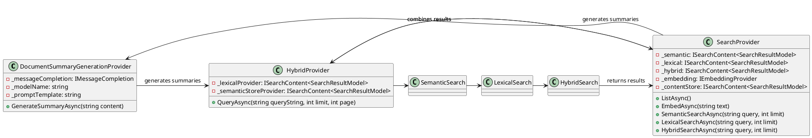

**README File**

This repository contains a set of source files for a search engine architecture that combines semantic, lexical, and hybrid approaches to provide search functionality.

**Summary**

The repository includes three main classes:

1. `DocumentSummaryGenerationProvider`: This class provides functionality to generate summaries for documents using a message completion service.
2. `HybridProvider`: This class represents a hybrid provider that combines results from lexical and semantic search providers.
3. `SearchProvider`: This class provides search functionality combining semantic, lexical, and hybrid search approaches.

**Technical Summary**

The design patterns used in this repository include:

* **Adapter Pattern**: The `DocumentSummaryGenerationProvider` class uses the adapter pattern to adapt the message completion service to generate summaries for documents.
* **Mapper Pattern**: The `HybridProvider` class uses the mapper pattern to map results from lexical and semantic search providers to a unified result set.
* **Visitor Pattern**: The `SearchProvider` class uses the visitor pattern to provide search functionality for different types of search queries.

**Component Diagram**

Note: The above diagram is a simplified representation of the architecture and may not include all the classes and relationships.