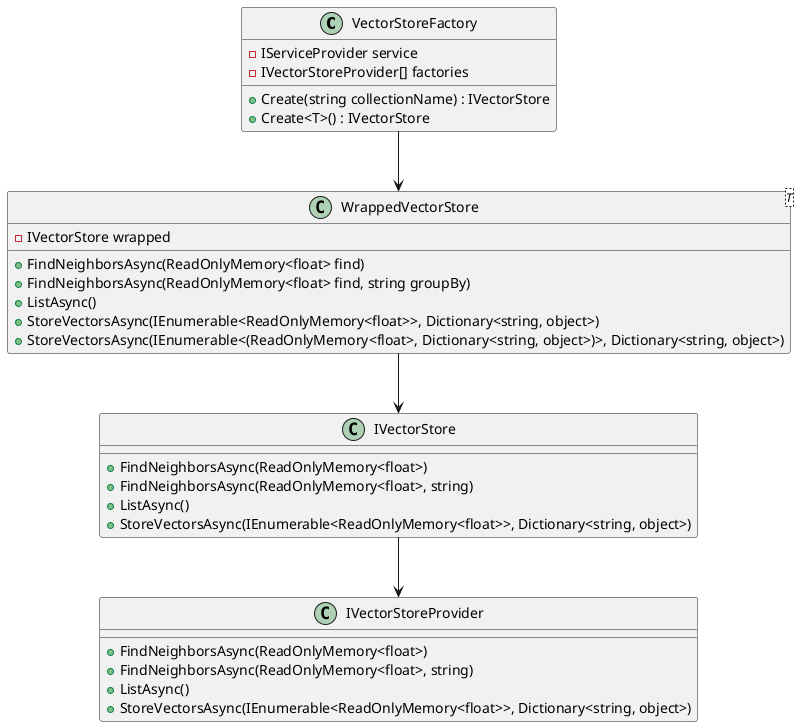

Here is a summary of the files:

**Summary:**
The provided files are part of a semantic search engine implementation, specifically the vector store component. The `VectorStoreFactory` class creates instances of `IVectorStore` based on a collection name or a type, while the `WrappedVectorStore` class acts as a wrapper around another vector store, providing additional functionality for finding neighbors, listing items, and storing vectors.

**Technical Summary:**
The files utilize the following design patterns and architectural patterns:

* Factory Pattern: `VectorStoreFactory` creates instances of `IVectorStore` based on a collection name or a type.
* Adapter Pattern: `WrappedVectorStore` adapts another vector store implementation to provide additional functionality.
* Dependency Injection: The `VectorStoreFactory` and `WrappedVectorStore` classes rely on the `IServiceProvider` to resolve dependencies.

**Component Diagram:**
