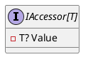

**IAccessor.cs Documentation**

**Class Diagram**



**API Documentation**

**IAccessor<T> Interface**

The `IAccessor<T>` interface is a type that allows for an instance to be bound to an async context.

### Properties

#### `Value`

* Type: `T?`
* Get/set: `get`; `set`
* Description: The accessible value.

### Summary

The `IAccessor<T>` interface provides a way to access a value of type `T` asynchronously. The interface is designed to be implemented by any class that needs to provide access to a value that can be updated or retrieved asynchronously.

### Notes

The `IAccessor<T>` interface is commonly used in scenarios where a value needs to be accessed or updated asynchronously, such as in a background thread or in response to an event. The interface provides a simple and consistent way to access the value, making it easier to write code that is decoupled and maintainable.

### Example

```csharp
public class MyAccessor : IAccessor<int>
{
    public int? Value { get; set; }
}
```

In this example, the `MyAccessor` class implements the `IAccessor<int>` interface, providing a property called `Value` that can be used to get or set the value of type `int`.