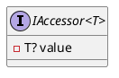
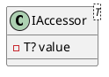

Here is the documentation for the source code in Markdown format:

# Eliassen.System.Accessors

## IAccessor<T> Interface

The `IAccessor<T>` interface is a type that allows for an instance to be bound to an async context.

### Interface Definition

```csharp
namespace Eliassen.System.Accessors;

public interface IAccessor<T>
{
    /// <summary>
    /// Accessible value
    /// </summary>
    T? Value { get; set; }
}
```

### Components and Interfaces



### Class Diagram



### Sequence Diagram

A sequence diagram illustrating the usage of the `IAccessor<T>` interface would show the following:

```plantuml
@startuml
actor "Caller"
actor "Accessor"

Accessor ->> Value: set
Value ->> Caller: Value
Caller ->> Accessor: get
Accessor ->> Value: Value
sequenceDiagram
@enduml
```

The `IAccessor<T>` interface is designed to be used in scenarios where an instance needs to be bound to an async context. The interface provides a single property `Value` which can be set and get.

The `Value` property is of type `T?` which is a nullable value type. This allows for scenarios where the value is not present.

The following sections will be added as the source code grows:

### Properties

### Methods

### Events