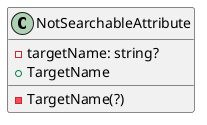
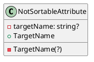
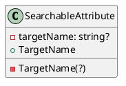
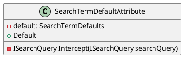
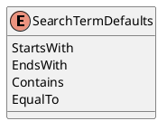

# Documentation for Eliassen.System.ComponentModel.Search

## Introduction

This documentation provides an overview of the Eliassen.System.ComponentModel.Search namespace, which provides attributes for controlling search behavior in .NET applications.

## Attributes

### NotSearchableAttribute

The `NotSearchableAttribute` is used to explicitly exclude properties or classes from search results.



### NotSortableAttribute

The `NotSortableAttribute` is used to specify that a property or class should not be sortable.



### SearchableAttribute

The `SearchableAttribute` is used to mark a property or class as searchable.



### SearchTermDefaultAttribute

The `SearchTermDefaultAttribute` is used to specify default search term options for comparison.



### SearchTermDefaults

The `SearchTermDefaults` enum specifies default search term options for comparison.



## Sequence Diagram

Here is a sequence diagram showing the interaction between the `SearchTermDefaultAttribute` and the `ISearchQuery` interface:
```plantuml
@startuml
actor "Search Query" as sq
participant "SearchTermDefaultAttribute" as sda
note "default search term option selected" as n
sq -> sda: Invoke Intercept
sda -> sq: Intercept(ISearchQuery searchQuery)
note "search query processed" as m
@enduml
```

This diagram shows how the `SearchTermDefaultAttribute` intercepts the search query and applies the default search term option specified in the attribute.

## Component Model

Here is a high-level component model showing the relationships between the different components:
```plantuml
@startuml
class System (<<system>>) {
  -[r:System]
  System -> Eliassen.System.ComponentModel.Search (<<search›)
  Eliassen.System.ComponentModel.Search -> NotSearchableAttribute (<<attribute›)
  Eliassen.System.ComponentModel.Search -> NotSortableAttribute (<<attribute›)
  Eliassen.System.ComponentModel.Search -> SearchableAttribute (<<attribute›)
  Eliassen.System.ComponentModel.Search -> SearchTermDefaultAttribute (<<attribute›)
  Eliassen.System.ComponentModel.Search -> SearchTermDefaults (<<enum›)
}
@enduml
```

This component model shows the Eliassen.System.ComponentModel.Search namespace as a component that provides a set of attributes for controlling search behavior. The attributes are used to customize the search behavior of properties and classes in the system.