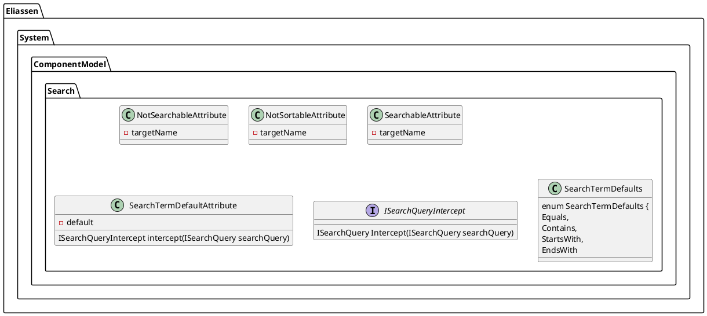

**README File**

This readme file describes the functionality and architecture of a set of .NET attributes used for search and filtering in a .NET application.

**Functionality Summary**

This set of attributes provides a way to control the search behavior of properties and classes in a .NET application. The attributes allow developers to specify whether a property or class should be searchable, sortable or excluded from search and sorting.

**Technical Summary**

The attributes use the following design patterns:

* Decorator pattern: The `NotSearchableAttribute`, `NotSortableAttribute`, and `SearchableAttribute` classes decorate the properties and classes they are applied to, changing their behavior.
* Factory pattern: The `SearchTermDefaultAttribute` class uses a factory to create a new instance of a `SearchQuery` object.
* Interface segregation principle: The `ISearchQueryIntercept` interface is used to separate the concerns of the `SearchTermDefaultAttribute` class.

**Component Diagram**

This component diagram shows the relationship between the attributes and the interfaces they implement. The `NotSearchableAttribute`, `NotSortableAttribute`, and `SearchableAttribute` classes decorate the properties and classes they are applied to, while the `SearchTermDefaultAttribute` class uses the `ISearchQueryIntercept` interface to intercept and modify the search query.