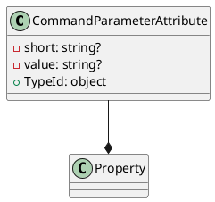

**CommandParameterAttribute Class Documentation**

**Namespace:** Eliassen.System.Configuration

**Class:** CommandParameterAttribute

**Purpose:** Specifies that a property represents a command parameter.

**Attributes:**

* `[AttributeUsage(AttributeTargets.Property, AllowMultiple = false)]`

**Methods:**

* `public string? Short { get; set; }`: Gets or sets the short representation of the command parameter.
* `public string? Value { get; set; }`: Gets or sets the value of the command parameter.
* `public override object TypeId => this;`: Gets a unique identifier for this attribute.

**PlantUML Class Diagram:**

This class represents a custom attribute that can be applied to properties to specify that they represent command parameters. The attribute has three properties: `Short` for the short representation of the command parameter, `Value` for the value of the command parameter, and `TypeId` for getting a unique identifier for the attribute. The attribute is designed to be used with properties, and it inherits from the `Attribute` class.

Note: The `Property` class is not defined in the provided code, but it is assumed to be a class that represents a property.