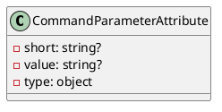
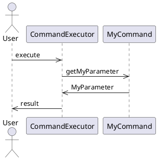

# Documentation for Eliassen.System.Configuration

## CommandParameterAttribute

### Overview

The `CommandParameterAttribute` is an attribute used to specify that a property represents a command parameter.

### Class Diagram

### Description

The `CommandParameterAttribute` is an attribute that can be applied to a property in a class. It indicates that the property represents a command parameter.

### Properties

#### Short

* Type: `string?`
* Gets or sets the short representation of the command parameter.

#### Value

* Type: `string?`
* Gets or sets the value of the command parameter.

#### TypeId

* Type: `object`
* Gets a unique identifier for this attribute.

### Example
```csharp
public class MyCommand {
  [CommandParameter]
  public string MyParameter { get; set; }
}
```
### Sequence Diagram

This sequence diagram illustrates the interaction between the user, the command executor, and the `MyCommand` class. The `CommandParameterAttribute` is used to specify that the `MyParameter` property represents a command parameter.