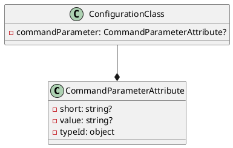

**README**

This collection of files provides a mechanism for specifying command parameters in a system configuration. The main functionality is to define an attribute that can be applied to a property, indicating that it represents a command parameter.

The `CommandParameterAttribute` class is a custom attribute that can be used to decorate a property in a configuration class. The attribute provides three properties: `Short`, `Value`, and `TypeId`.

**Technical Summary**

The design pattern used in this implementation is the Attribute-Based Programming pattern. Specifically, the `CommandParameterAttribute` class is used to mark a property as a command parameter, allowing for easy retrieval and processing of the property's value.

The architectural pattern used is the Decorator pattern, where the attribute is used to decorate the property, adding additional functionality without modifying the property itself.

**Component Diagram**

