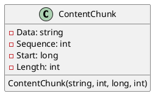
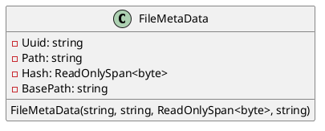
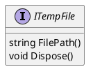
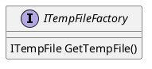

Here is the documentation for the source code in markdown format, including PlantUML diagrams.

**Overview**

This library provides a set of classes and interfaces for working with temporary files in a managed environment. It includes classes for representing file metadata, content chunks, and temp files, as well as interfaces for creating and managing temp files.

**Classes**

### ContentChunk

```ContentChunk.cs
namespace Eliassen.System.IO;

public record ContentChunk
{
    public string Data { get; }
    public int Sequence { get; }
    public long Start { get; }
    public int Length { get; }

    public ContentChunk(string data, int sequence, long start, int length)
    {
        Data = data;
        Sequence = sequence;
        Start = start;
        Length = length;
    }
}
```

**Class Diagram**


### FileMetaData

```FileMetaData.cs
using System;

namespace Eliassen.System.IO;

public readonly ref struct FileMetaData
{
    public string Uuid { get; init; }
    public string Path { get; init; }
    public ReadOnlySpan<byte> Hash { get; init; }
    public string BasePath { get; init; }

    public FileMetaData(string uuid, string path, ReadOnlySpan<byte> hash, string basePath)
    {
        Uuid = uuid;
        Path = path;
        Hash = hash;
        BasePath = basePath;
    }
}
```

**Class Diagram**


### ITempFile

```ITempFile.cs
using System;

namespace Eliassen.System.IO;

public interface ITempFile : IDisposable
{
    string FilePath { get; }
}
```

**Interface Diagram**


### ITempFileFactory

```ITempFileFactory.cs
namespace Eliassen.System.IO;

public interface ITempFileFactory
{
    ITempFile GetTempFile();
}
```

**Interface Diagram**


**Sequence Diagram**

```plantuml
@startuml
participant FS as "File System"
participant Factory as "ITempFileFactory"
participant TempFile as "ITempFile"

note left
  Get a managed temporary file from the factory
  The file will be deleted when disposed
note right
  Use the temp file

FS -> Factory: GetTempFile()
Factory ->> TempFile: ITempFile
TempFile ->> FS: Temp file operations
@enduml
```

This sequence diagram shows how a client can use the `ITempFileFactory` to get a managed temporary file, which will be deleted when disposed. The temp file can then be used for temp file operations, such as reading and writing.