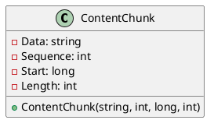
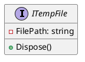
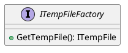

Here is the documentation and PlantUML class diagrams for the provided source code files:

**ContentChunk.cs**

* **Summary**: Represents a chunk of content along with metadata.
* **Description**: This class represents a chunk of content along with its sequence number, starting position, and length within the original content.
* **Properties**:
	+ `Data`: Gets the data of the content chunk.
	+ `Sequence`: Gets the sequence number of the chunk within the original content.
	+ `Start`: Gets the starting position of the chunk within the original content.
	+ `Length`: Gets the length of the chunk.
* **Constructor**: Initializes a new instance of the `ContentChunk` class with the specified `data`, `sequence`, `start`, and `length`.



**FileMetaData.cs**

* **Summary**: Represents metadata associated with a file.
* **Description**: This record represents metadata associated with a file, including its UUID, path, hash value, and base path.
* **Properties**:
	+ `Uuid`: Gets the universally unique identifier (UUID) of the file.
	+ `Path`: Gets the path of the file.
	+ `Hash`: Gets the hash value of the file.
	+ `BasePath`: Gets the base path of the file.
* **Constructor**: Initializes a new instance of the `FileMetaData` record with the specified `uuid`, `path`, `hash`, and `basePath`.

```plantuml
@startuml
record FileMetaData {
  - Uuid: string
  - Path: string
  - Hash: ReadOnlySpan<byte>
  - BasePath: string
  + FileMetaData(string, string, ReadOnlySpan<byte>, string)
}

@enduml
```

**ITempFile.cs**

* **Summary**: Temp file handle.
* **Description**: This interface represents a handle for a temporary file, which will be deleted when disposed.
* **Properties**:
	+ `FilePath`: Gets the path to the temporary file.



**ITempFileFactory.cs**

* **Summary**: This is a provider for managed temp files.
* **Description**: This interface represents a factory for creating managed temporary files, which will be deleted when disposed.
* **Methods**:
	+ `GetTempFile()`: Gets a managed temporary file.



Note: The `ITempFile` interface has a `Dispose()` method, which is not shown in the code snippet provided. It is assumed that this method will be implemented by the implementing class to dispose of the temporary file.