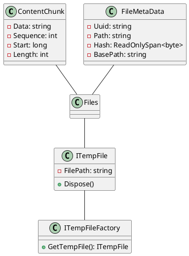

**README**

This package provides a set of classes and interfaces for managing temporary files and their associated metadata. The main components are:

1. `ContentChunk`: Represents a chunk of content along with metadata, such as sequence number, start position, and length.
2. `FileMetaData`: Represents metadata associated with a file, including UUID, path, hash value, and base path.
3. `ITempFile`: Defines an interface for managing temporary files, providing access to the file path and disposal.
4. `ITempFileFactory`: Defines an interface for creating managed temporary files, which are automatically deleted when disposed.

**Technical Summary**

The package employs various design patterns and architectural patterns:

1. **Record types**: `ContentChunk` and `FileMetaData` are implemented as record types, which provide a lightweight and immutable way to represent structured data.
2. **Value objects**: `ContentChunk` and `FileMetaData` are value objects, which encapsulate their own state and behavior.
3. **Factory pattern**: The `ITempFileFactory` interface implements the factory pattern, allowing clients to create managed temporary files without knowing the implementation details.
4. **Disposable pattern**: The `ITempFile` interface implements the disposable pattern, ensuring that temporary files are properly cleaned up when no longer needed.

**Component Diagram**

This component diagram shows the relationships between the classes and interfaces:

* `ContentChunk` and `FileMetaData` are related to each other through their association with `Files`.
* `ITempFile` is related to `ITempFileFactory` through the `GetTempFile()` method, which creates an instance of `ITempFile`.
* `ITempFile` is also associated with `Files`, indicating that it manages temporary files.