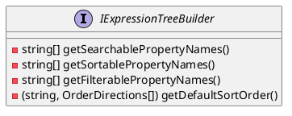

# Documentation for Eliassen.System.Linq.Expressions

## IExpressionTreeBuilder Interface

### Overview

The `IExpressionTreeBuilder` interface represents a builder for constructing expression trees used in querying and filtering.

### Methods

#### GetSearchablePropertyNames()

* Returns: `IReadOnlyCollection<string>` - The collection of searchable property names.

#### GetSortablePropertyNames()

* Returns: `IReadOnlyCollection<string>` - The collection of sortable property names.

#### GetFilterablePropertyNames()

* Returns: `IReadOnlyCollection<string>` - The collection of filterable property names.

#### DefaultSortOrder()

* Returns: `IReadOnlyCollection<(string column, OrderDirections direction)>` - The collection of default sort order information.

### Class Diagram (PlantUML)
