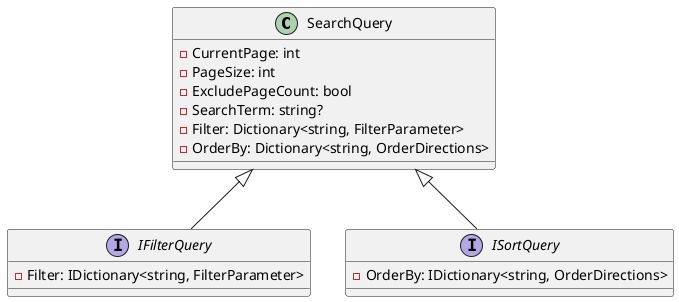
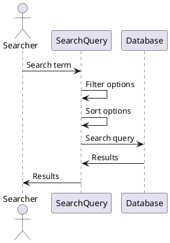

Here is the documentation for the source code in Markdown format:

**SearchQuery.cs**
================

This file defines a `SearchQuery` class that represents a search query with filtering and sorting options for a specific model or a generic search query.

## Class Diagram


## Component Model
```plantuml
@startuml
component SearchQuery {
  - CurrentPage
  - PageSize
  - ExcludePageCount
  - SearchTerm
  - Filter
  - OrderBy
}

component Filter {
  - Key: string
  - Value: FilterParameter
}

component OrderDirections {
  - Ascending
  - Descending
}

component Dictionary<string, FilterParameter> {
  - Key: string
  - Value: FilterParameter
}

component Dictionary<string, OrderDirections> {
  - Key: string
  - Value: OrderDirections
}

SearchQuery ..> Filter
SearchQuery ..> OrderDirections
Filter ..> Dictionary
OrderDirections ..> Dictionary
@enduml
```

## Sequence Diagram


## Class Description
The `SearchQuery` class represents a search query with filtering and sorting options for a specific model or a generic search query. It has several properties that can be used to customize the search query, including:

* `CurrentPage`: The current page number.
* `PageSize`: The page size.
* `ExcludePageCount`: A boolean indicating whether to exclude page count from the result.
* `SearchTerm`: The search term.
* `Filter`: A dictionary of filters for the query.
* `OrderBy`: A dictionary of sorting options for the query.

The class also implements the `IFilterQuery` and `ISortQuery` interfaces, which provide the `Filter` and `OrderBy` properties, respectively.

The `ToString()` method generates a string representation of the search query, including the current page, page size, exclude page count, search term, filters, and sorting options.

## Messages
The class defines several messages that can be used to communicate with the search query, including:

* `NoSearchQueryFilter`: No filtering detected.
* `NoPropertyFilter`: No filtering for property.
* `SortPropertiesNotFound`: Sort properties not found on model.
* `ApplySortDefault`: Applying default sort order.
* `ForceSortDefault`: Forcing sort order.

These messages can be used to inform the user about the status of the search query.