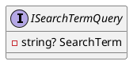
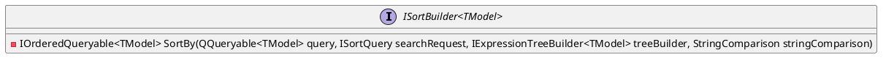
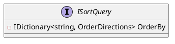
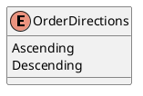
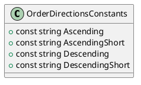

# Eliassen.System.Linq.Search Documentation

## ISearchTermQuery Interface

### Summary

Represents a query object that includes a search term for filtering data.

### Properties

* `SearchTerm`: Gets the search term used for filtering data.

## ISortBuilder Interface

### Summary

Represents an interface for building sorting expressions and applying sorting to a query.

### Methods

* `SortBy(Queryable<TModel> query, ISortQuery searchRequest, IExpressionTreeBuilder<TModel> treeBuilder, StringComparison stringComparison)`: Sorts the specified query based on the provided sort criteria.

### Type Parameters

* `TModel`: The type of the model.

## ISortQuery Interface

### Summary

Represents an interface for specifying sorting criteria in a query.

### Properties

* `OrderBy`: Gets a dictionary containing sorting information, where the key is the column name and the value is the sort direction.

## OrderDirections Enum

### Summary

Enumeration to control sort order.

### Values

* `Ascending`: Sort related items in ascending order.
* `Descending`: Sort related items in descending order.

## OrderDirectionsConstants Class

### Summary

Provides constants for order directions.

### Constants

* `Ascending`: Represents the ascending order direction.
* `AscendingShort`: Represents a short form of the ascending order direction.
* `Descending`: Represents the descending order direction.
* `DescendingShort`: Represents a short form of the descending order direction.