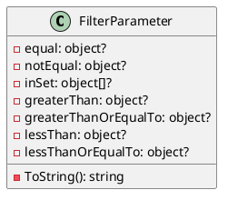
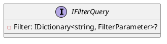
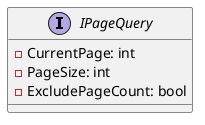
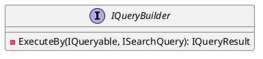
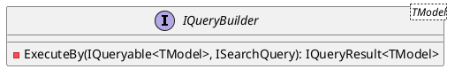
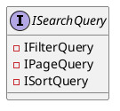
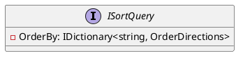
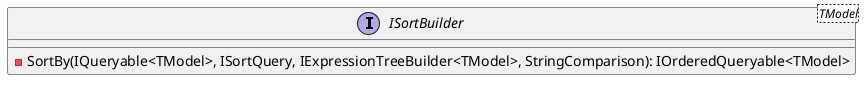
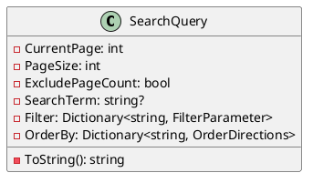

Here is the documentation for the given source code files along with the class diagrams in PlantUML:

**FilterParameter.cs**

**Documentation:**

The `FilterParameter` class is a record that represents a filter parameter for a search query. It has several properties for filtering, sorting, and inclusive/exclusive criteria: `EqualTo`, `NotEqualTo`, `InSet`, `GreaterThan`, `GreaterThanOrEqualTo`, `LessThan`, and `LessThanOrEqualTo`. The `ToString` method provides a string representation of the filter parameter.

**IFilterQuery.cs**

**Documentation:**

The `IFilterQuery` interface defines a method `Filter` that returns a dictionary of filter parameters for a search query. The filter parameters are used to filter the search results based on various criteria.

**IPageQuery.cs**

**Documentation:**

The `IPageQuery` interface defines three properties: `CurrentPage`, `PageSize`, and `ExcludePageCount`. `CurrentPage` specifies the current page number, `PageSize` specifies the number of items per page, and `ExcludePageCount` indicates whether to exclude the total page count from the result.

**IQueryBuilder.cs**

**Documentation:**

The `IQueryBuilder` interface defines a method `ExecuteBy` that executes a query using the specified query and search query. The `ExecuteBy` method returns an `IQueryResult` object.

**IQueryBuilder<TModel>.cs**

**Documentation:**

The `IQueryBuilder<TModel>` interface defines a method `ExecuteBy` that executes a query using the specified typed query and search query. The `ExecuteBy` method returns an `IQueryResult<TModel>` object.

**ISearchQuery.cs**

**Documentation:**

The `ISearchQuery` interface defines a union of three interfaces: `IFilterQuery`, `IPageQuery`, and `ISortQuery`. The `ISearchQuery` interface is used to combine filtering, sorting, and page options for a search query.

**ISortQuery.cs**

**Documentation:**

The `ISortQuery` interface defines a method `OrderBy` that returns a dictionary of sorting options for a search query. The sorting options are used to sort the search results based on various criteria.

**ISortBuilder.cs**

**Documentation:**

The `ISortBuilder<TModel>` interface defines a method `SortBy` that sorts a specified query based on the provided sort criteria. The `SortBy` method returns an `IOrderedQueryable<TModel>` object.

**SearchQuery.cs**

**Documentation:**

The `SearchQuery` class is a record that encapsulates a search query with filtering, sorting, and page options. It has properties for the current page number, page size, and exclude page count, as well as a search term and filter parameters. The `ToString` method provides a string representation of the search query.