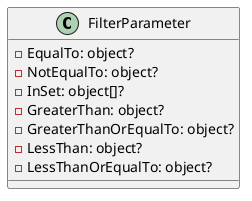
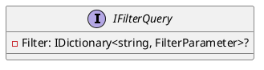
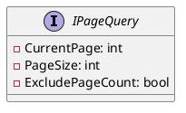
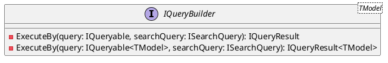
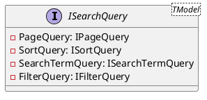

Here is the documentation for the source code in Markdown format:

# Eliassen System Linq Search

## Overview

The Eliassen System Linq Search library provides a set of classes and interfaces for building and executing queries with search parameters. The library includes classes for filtering, sorting, and paginating data, as well as converting filter parameters to strings.

## Classes

### FilterParameter



The `FilterParameter` class represents a filter parameter with various properties for filtering data. The properties include `EqualTo`, `NotEqualTo`, `InSet`, `GreaterThan`, `GreaterThanOrEqualTo`, `LessThan`, and `LessThanOrEqualTo`.

### IFilterQuery



The `IFilterQuery` interface represents a query with filtering options. The `Filter` property returns a dictionary of filter parameters.

### IPageQuery



The `IPageQuery` interface represents a page query for paginating results. The `CurrentPage`, `PageSize`, and `ExcludePageCount` properties provide information about the current page and the size of each page.

### IQueryBuilder



The `IQueryBuilder` interface represents a query builder for executing queries with search parameters. There are two versions of the interface: a generic version that can be used with any type, and a typed version that is used with a specific type.

### ISearchQuery



The `ISearchQuery` interface represents a query object that combines page, sort, search term, and filter criteria for searching data. The generic version of the interface can be used with any type, and the typed version is used with a specific type.

## Sequence Diagram

```plantuml
@startuml
sequenceDiagram
    participant QueryBuilder as "QueryBuilder"
    participant QuerySample as "QuerySample"
    participant SearchQuery as "SearchQuery"

    QueryBuilder->>QuerySample: Retrieve data
    QueryBuilder->>SearchQuery: Get search query
    SearchQuery->>QueryBuilder: Execute query
    QueryBuilder->>QuerySample: Retrieve filtered data

    note overwrite: "The QueryBuilder uses the SearchQuery to filter the data."
@enduml
```

This sequence diagram shows how the QueryBuilder uses the SearchQuery to filter data. The QueryBuilder retrieves data from a sample query, gets the search query, executes the query, and retrieves the filtered data.