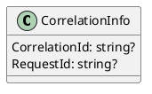
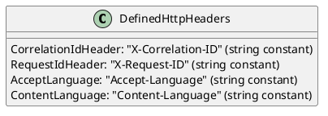

**CorrelationInfo.cs**

**Documentation:**

The `CorrelationInfo` class represents information related to correlation and tracking in a system. This class is used to store and manage correlation identifiers and request identifiers.

**Class Diagram (PlantUML):**

**Description:**

The `CorrelationInfo` class has two properties:

* `CorrelationId`: A string property that represents the correlation identifier used to associate related operations or events across different components or services.
* `RequestId`: A string property that represents the request identifier used to uniquely identify a specific request or operation within a system.

**DefinedHttpHeaders.cs**

**Documentation:**

The `DefinedHttpHeaders` class contains constant values for commonly used HTTP headers.

**Class Diagram (PlantUML):**

**Description:**

The `DefinedHttpHeaders` class contains four constant string properties:

* `CorrelationIdHeader`: A constant string representing the "X-Correlation-ID" HTTP header used for correlation identification.
* `RequestIdHeader`: A constant string representing the "X-Request-ID" HTTP header used for request identification.
* `AcceptLanguage`: A constant string representing the "Accept-Language" HTTP header used for specifying acceptable languages for the response.
* `ContentLanguage`: A constant string representing the "Content-Language" HTTP header used for specifying the language of the content.

Note: The PlantUML code is used to generate a class diagram, which is a visual representation of the classes and their relationships. The diagram is not included in this documentation, but it can be generated separately using a PlantUML tool or plugin.