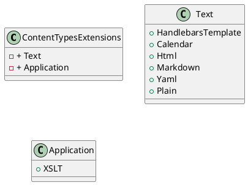

Here is the documentation for the `ContentTypesExtensions` source code file, including a class diagram in PlantUML:

**Class Documentation**

Namespace: Eliassen.System.Net.Mime

Class: ContentTypesExtensions

**Summary**

Provides constants representing various content types.

**Class Diagram (PlantUML)**

**Class Hierarchy**

* `ContentTypesExtensions` (static class)
	+ `Text` (static class)
		- `HandlebarsTemplate`
		- `Calendar`
		- `Html`
		- `Markdown`
		- `Yaml`
		- `Plain`
	+ `Application` (static class)
		- `XSLT`

**Description**

The `ContentTypesExtensions` class provides a collection of constants representing various content types. The class is divided into two static classes: `Text` and `Application`. The `Text` class contains constants for text-based content types, while the `Application` class contains constants for application-based content types.

**Constants**

* `HandlebarsTemplate`: Represents the content type for Handlebars templates.
* `Calendar`: Represents the content type for calendar data.
* `Html`: Represents the content type for HTML.
* `Markdown`: Represents the content type for Markdown.
* `Yaml`: Represents the content type for Yaml.
* `Plain`: Represents the content type for Plain text.
* `XSLT`: Represents the content type for XSLT (XML Stylesheet Language Transformations).

**Notes**

* The constants are represented as static strings.
* The class is designed to provide a centralized location for content type constants, making it easier to maintain and update the content types.