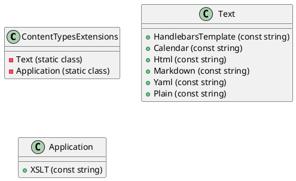
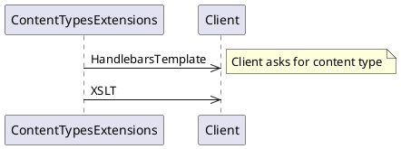

## Content Types Extensions Documentation

### Introduction

The `ContentTypesExtensions` class provides a set of constants representing various content types. These constants are grouped into two categories: `Text` and `Application`.

### Class Diagram


### Description

The `ContentTypesExtensions` class is a static class that provides a way to represent various content types. The class is divided into two categories: `Text` and `Application`.

The `Text` class represents text-based content types. It includes the following constants:

* `HandlebarsTemplate`: The content type for Handlebars templates.
* `Calendar`: The content type for calendar data.
* `Html`: The content type for HTML.
* `Markdown`: The content type for Markdown.
* `Yaml`: The content type for Yaml.
* `Plain`: The content type for plain text.

The `Application` class represents application-based content types. It includes the following constant:

* `XSLT`: The content type for XSLT (XML Stylesheet Language Transformations).

### Sequence Diagram


### Usage

To use the `ContentTypesExtensions` class, you can access the constants directly from the class. For example:
```csharp
string contentType = ContentTypesExtensions.Text.HandlebarsTemplate;
```
### Change Log

* Version 1.0: Initial implementation.

### Copyright and License

The `ContentTypesExtensions` class is copyright (c) 2023 by Eliassen. It is licensed under the MIT License.