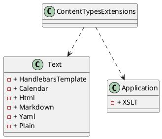

**README for ContentTypesExtensions.cs**

This file contains a set of constants representing various content types, categorized into two classes: `Text` and `Application`. The `ContentTypesExtensions` class provides a collection of static constants that can be used to identify different types of content.

**Summary**

The `ContentTypesExtensions` class provides a way to identify different types of content, including text-based content types (such as HTML, Markdown, and YAML) and application-based content types (such as XSLT). This can be useful in situations where content requires specific handling or processing.

**Technical Summary**

This file employs the Strategy pattern, a design pattern that allows for the selection of one of several algorithms or behaviors at runtime. In this case, the `ContentTypesExtensions` class serves as the strategy, providing a set of constants that can be used to identify different content types.

**Component Diagram**

Here is a component diagram illustrating the relationships between the classes in this file:
