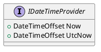

# Eliassen.System.Providers Documentation

## Overview

The Eliassen.System.Providers namespace provides a set of interfaces for date and time, and GUID generation. These interfaces enable developers to abstractly work with date and time, and GUID generation.

## Interfaces

### IDateTimeProvider

#### Purpose

Provides date and time functionality.

#### Methods

* `DateTimeOffset Now`: Gets the current local date and time.
* `DateTimeOffset UtcNow`: Gets the current Coordinated Universal Time (UTC) date and time.

```
