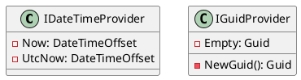

Here is the README file:

**Overview**
---------

This project provides a set of interfaces for working with dates, times, and GUIDs. The interfaces are designed to be easily extendable and can be used in a variety of applications.

**Technical Summary**
--------------

The project uses the following design patterns and architectural patterns:

* **Interface Segregation Principle (ISP)**: The project separates concerns into distinct interfaces (`IDateTimeProvider` and `IGuidProvider`) to promote flexibility and scalability.
* **Single Responsibility Principle (SRP)**: Each interface has a single responsibility, making it easier to maintain and extend the codebase.

**Component Diagram**
--------------------

The following Component Diagram is generated using PlantUML:

**Summary**
--------

The `IDateTimeProvider` interface provides functionality for working with dates and times, including getting the current local date and time and the current Coordinated Universal Time (UTC) date and time. The `IGuidProvider` interface provides functionality for generating and handling GUIDs, including generating a new GUID and getting an empty GUID.

The interfaces are designed to be easily extendable and can be used in a variety of applications.