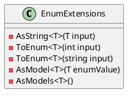
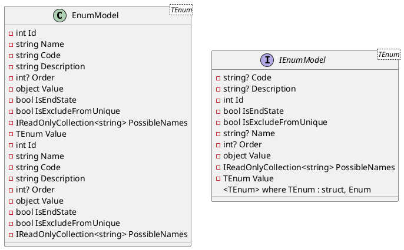
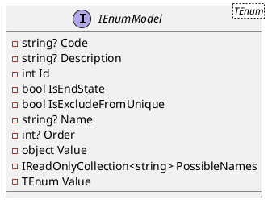
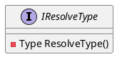

Here is the documentation for the provided source code files, along with the class diagrams in PlantUML:

**EnumExtensions.cs**

Provides extension methods for working with enumerations.

```
public static class EnumExtensions
{
    // Extension methods for converting between enumeration values and their string representations.
}
```

Class Diagram:


**EnumModel.cs**

Represents an enumeration model.

```
internal record EnumModel : IEnumModel
{
    // Properties and fields for representing an enumeration value.
}

internal record EnumModel<TEnum> : EnumModel, IEnumModel<TEnum> where TEnum : struct, Enum
{
    // The strongly-typed value of the enumeration.
}
```

Class Diagram:


**IEnumModel.cs**

Represents an interface for providing information about an enumeration value.

```
public interface IEnumModel
{
    // Properties and methods for representing an enumeration value.
}

public interface IEnumModel<TEnum> : IEnumModel
    where TEnum : struct, Enum
{
    // The strongly-typed value of the enumeration.
}
```

Class Diagram:


**IResolveType.cs**

Represents an interface for resolving a `Type`.

```
public interface IResolveType
{
    // Method for resolving and returning the associated `Type`.
}
```

Class Diagram:


Note: The PlantUML diagrams are provided in a simplified format to illustrate the relationships between the classes and interfaces. For a more detailed and accurate representation, please consult the official PlantUML documentation or use a PlantUML tool to generate the diagrams.