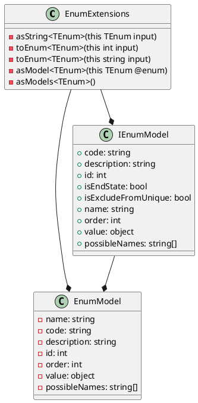
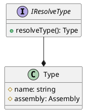

Here is the documentation in Markdown format:

# EnumExtensions

The `EnumExtensions` class provides a set of extension methods for working with enumerations. These methods can be used to convert enumeration values to and from their string representations, as well as to parse and format enumeration values.

## Classes

### EnumExtensions

* `EnumExtensions`: Provides extension methods for working with enumerations.
* `First`: Returns the first non-null value from an array of strings.
* `AsString<TEnum>`: Converts an enumeration value to its associated string representation.
* `ToEnum<TEnum>`: Converts an integer value to an enumeration value.
* `ToEnum<TEnum>`: Converts a string to an enumeration value.
* `AsModel<TEnum>`: Gets the enumeration model for a specific enumeration value.
* `AsModels<TEnum>`: Gets a collection of enumeration models for all values of a specific enumeration type.

### EnumModel

* `EnumModel`: Represents a model for an enumeration value.
* `EnumModel<TEnum>`: Represents a model for an enumeration value of type `TEnum`.
* `Name`: Gets the name of the enumeration value.
* `Code`: Gets the code associated with the enumeration value.
* `Description`: Gets the description associated with the enumeration value.
* `Id`: Gets the numerical identifier of the enumeration value.
* `Order`: Gets the order of the enumeration value.
* `Value`: Gets the underlying value of the enumeration.
* `PossibleNames`: Gets a collection of possible names for the enumeration value.

### IEnumModel

* `IEnumModel`: Represents a generic interface for providing information about an enumeration value.
* `Code`: Gets the code associated with the enumeration value.
* `Description`: Gets the description associated with the enumeration value.
* `Id`: Gets the numerical identifier of the enumeration value.
* `IsEndState`: Gets a value indicating whether the enumeration value is an end state.
* `IsExcludeFromUnique`: Gets a value indicating whether the enumeration value is excluded from uniqueness checks.
* `Name`: Gets the name of the enumeration value.
* `Order`: Gets the order of the enumeration value.
* `Value`: Gets the underlying value of the enumeration.
* `PossibleNames`: Gets a collection of possible names for the enumeration value.

### IEnumModel<TEnum>

* `IEnumModel<TEnum>`: Represents a generic interface for providing information about an enumeration value of type `TEnum`.
* `Code`: Gets the code associated with the enumeration value.
* `Description`: Gets the description associated with the enumeration value.
* `Id`: Gets the numerical identifier of the enumeration value.
* `IsEndState`: Gets a value indicating whether the enumeration value is an end state.
* `IsExcludeFromUnique`: Gets a value indicating whether the enumeration value is excluded from uniqueness checks.
* `Name`: Gets the name of the enumeration value.
* `Order`: Gets the order of the enumeration value.
* `Value`: Gets the strongly-typed value of the enumeration.
* `PossibleNames`: Gets a collection of possible names for the enumeration value.

### IResolveType

* `IResolveType`: Represents an interface for resolving a `Type`.

## PlantUML Diagrams

Note: The `EnumExtensions` class is not shown in the sequence diagram, as it is a static class and does not have any methods that can be called.