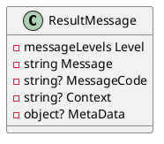

# Eliassen System Response Model Documentation
=============================

## ResultMessage Class

### Description

The `ResultMessage` class is used to encapsulate additional details about a response. This class provides properties for the importance level of the response, a simple English message about the issue, a unique code for translating the issue, a property or path related to the message, and additional metadata.

### Properties

#### `Level`

* Type: `MessageLevels`
* Description: Importance level related to the response
* Default value: `MessageLevels.Information`

#### `Message`

* Type: `string`
* Description: Simple English message about the issue
* Required: Yes

#### `MessageCode`

* Type: `string`
* Description: Unique code that may be used to assist in translating the issue
* Default value: `null`

#### `Context`

* Type: `string`
* Description: Property or path related to this message
* Default value: `null`

#### `MetaData`

* Type: `object`
* Description: Additional properties related to the response
* Default value: `null`

### Class Diagram


### Component Model
```plantuml
@startuml
component ResultMessage {
  description "additional details about response"
  interface "importance level related to response" as Level
  interface "Simple English message about issue. " as Message
  interface "unique code that may be used to assist in translating issue" as MessageCode
  interface "Property or path related to this message" as Context
  interface "additional properties related to response" as MetaData
}

@enduml
```

### Sequence Diagram (Not applicable in this case, as there is no specific sequence of events for the `ResultMessage` class)

By using the `ResultMessage` class, developers can effectively manage and utilize response messages in their application, providing valuable context and detail for error handling and issue resolution.