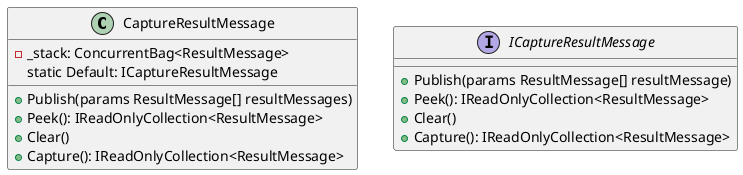
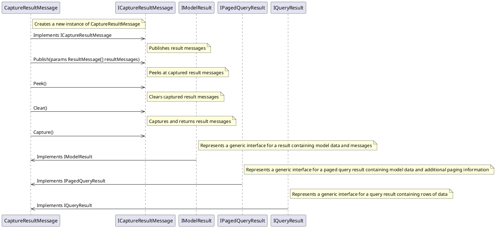

Here is the documentation for the provided source code in Markdown format.

# Eliassen.System.ResponseModel

This is a .NET class library for capturing and responding to query results.

# CaptureResultMessage

The `CaptureResultMessage` class is a implementation of `ICaptureResultMessage` for capturing and publishing result messages.

### Properties

* `Default`: Gets the default instance of `ICaptureResultMessage`.

### Methods

* `Publish`: Publishes result messages to the capture stack.
* `Peek`: Peeks at the current contents of the capture stack without clearing it.
* `Clear`: Clears the captured result messages.
* `Capture`: Captures and returns the result messages, removing them from the capture.

### Class Diagram

# ICaptureResultMessage

The `ICaptureResultMessage` interface represents an interface for capturing and publishing result messages.

### Methods

* `Publish`: Publishes the specified result messages.
* `Peek`: Peeks at the captured result messages without removing them.
* `Clear`: Clears the captured result messages.
* `Capture`: Captures and returns the result messages, removing them from the capture.

# IModelResult

The `IModelResult` interface represents a generic interface for a result containing model data and messages.

### Properties

* `Data`: Gets the data associated with the result.
* `Messages`: Gets a collection of messages associated with the result.

### Subinterface

* `IModelResult<TModel>`: Represents a generic interface for a result containing model data of type `TModel` and messages.

# IPagedQueryResult

The `IPagedQueryResult` interface represents a generic interface for a paged query result containing model data and additional paging information.

### Properties

* `CurrentPage`: Gets the current page number.
* `TotalPageCount`: Gets the total number of pages.
* `TotalRowCount`: Gets the total number of rows across all pages.

### Subinterface

* `IPagedQueryResult<TModel>`: Represents a generic interface for a paged query result containing model data of type `TModel` and additional paging information.

# IQueryResult

The `IQueryResult` interface represents a generic interface for a query result containing rows of data.

### Properties

* `Rows`: Gets the collection of rows in the query result.

### Subinterface

* `IQueryResult<TModel>`: Represents a generic interface for a query result containing model data of type `TModel`.

Sequence Diagram

Note: The sequence diagram is a high-level representation of the interaction between the classes and interfaces in the system. It does not show the exact sequence of method calls, but rather the overall flow of interactions between the classes.