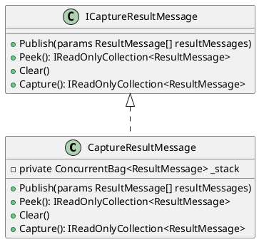
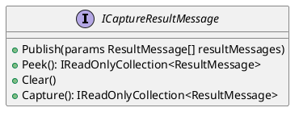
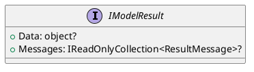
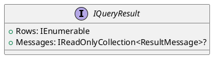
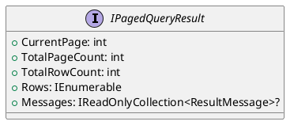
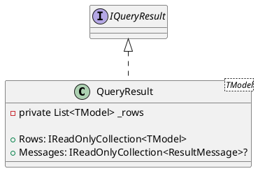

Here is the documentation for the provided source code files, including class diagrams using PlantUML:

**CaptureResultMessage.cs**

```
/**
 * @class CaptureResultMessage
 * @brief Implementation of <see cref="ICaptureResultMessage"/> for capturing and publishing result messages.
 */
public class CaptureResultMessage : ICaptureResultMessage
{
    // ...
}
```

**Class Diagram:**



**ICaptureResultMessage.cs**

```
/**
 * @interface ICaptureResultMessage
 * @brief Represents an interface for capturing and publishing result messages.
 */
public interface ICaptureResultMessage
{
    // ...
}
```

**Class Diagram:**



**IModelResult.cs**

```
/**
 * @interface IModelResult
 * @brief Represents a generic interface for a result containing model data and messages.
 */
public interface IModelResult
{
    // ...
}
```

**Class Diagram:**



**IQueryResult.cs**

```
/**
 * @interface IQueryResult
 * @brief Represents a generic interface for a query result containing rows of data.
 */
public interface IQueryResult
{
    // ...
}
```

**Class Diagram:**



**IPagedQueryResult.cs**

```
/**
 * @interface IPagedQueryResult
 * @brief Represents a generic interface for a paged query result containing model data and additional paging information.
 */
public interface IPagedQueryResult
{
    // ...
}
```

**Class Diagram:**



**ModelResult.cs**

```
/**
 * @record ModelResult<TModel>
 * @brief Represents a result containing a single model.
 */
public record ModelResult<TModel> : IModelResult<TModel>
{
    // ...
}
```

**Class Diagram:**

```plantuml
@startuml
record ModelResult<TModel> implements IModelResult<TModel> {
  + Data: TModel?
  + Messages: IReadOnlyCollection<ResultMessage>?
}

@enduml
```

**PagedQueryResult.cs**

```
/**
 * @class PagedQueryResult<TModel>
 * @brief Represents the result of a paged query, including information about the current page, total page count, total row count, and a collection of items.
 */
public class PagedQueryResult<TModel> : QueryResult<TModel>, IPagedQueryResult<TModel>
{
    // ...
}
```

**Class Diagram:**

```plantuml
@startuml
class PagedQueryResult<TModel> implements IPagedQueryResult<TModel>, IQueryResult<TModel> {
  - private int _currentPage
  - private int _totalPageCount
  - private int _totalRowCount
  - private IEnumerable<TModel> _items

  + CurrentPage: int
  + TotalPageCount: int
  + TotalRowCount: int
  + Rows: IReadOnlyCollection<TModel>
  + Messages: IReadOnlyCollection<ResultMessage>?
}

@enduml
```

**QueryResult.cs**

```
/**
 * @class QueryResult<TModel>
 * @brief Represents the result of a query operation, containing a collection of items and optional result messages.
 */
public class QueryResult<TModel> : IQueryResult<TModel>
{
    // ...
}
```

**Class Diagram:**



**ResultMessage.cs**

```
/**
 * @record ResultMessage
 * @brief Additional details about a response.
 */
public record