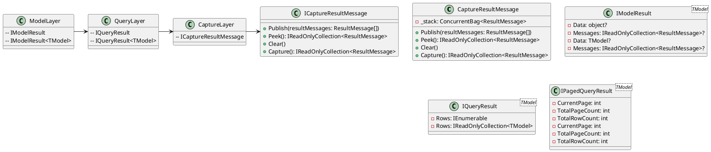

**README:** Eliassen System Response Model

The Eliassen System Response Model is a .NET library that provides a set of interfaces and classes for capturing, processing, and publishing result messages. The library is designed to be used in a variety of applications, including web services, APIs, and data processing pipelines.

**Technical Summary:**

The library employs several design patterns and architectural patterns to achieve its goals. The **"Composite" pattern** is used in the `CaptureResultMessage` class, which allows it to publish and capture result messages in a stack-like manner. The **"Thread-safe" pattern** is used in the `Publish` method to ensure that the capture stack is updated safely across multiple threads.

The library's architecture is based on a **Layered Architecture**, with three main layers:

1. **Model**: This layer provides interfaces for result models, such as `IModelResult` and `IModelResult<TModel>`, which define the structure and behavior of result data.
2. **Query**: This layer provides interfaces for query results, such as `IQueryResult` and `IQueryResult<TModel>`, which define the structure and behavior of query results.
3. **Capture**: This layer provides interfaces for capturing and publishing result messages, such as `ICaptureResultMessage` and `CaptureResultMessage`, which define the behavior of the capture stack.

**Component Diagram:**

This component diagram illustrates the relationships between the different classes and interfaces in the library, showing the layered architecture and how the interfaces and classes interact with each other.