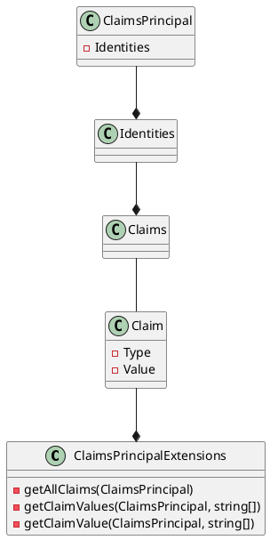
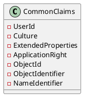

Here is the documentation for the provided source code files:

**ClaimsPrincipalExtensions.cs**

Namespace: Eliassen.System.Security.Claims

Summary: Extensions to manage Claim on ClaimsPrincipal

### Methods

#### GetAllClaims(this ClaimsPrincipal principal)

**Sumary**: Iterate all Claim for provided ClaimsPrincipal

**Returns**: IEnumerable(Claim)

Parameters:

* `principal`: ClaimsPrincipal

#### GetClaimValues(this ClaimsPrincipal principal, params string[] claims)

**Summary**: Get for matched Claim on ClaimsPrincipal

**Returns**: IEnumerable<(string, string)>

Parameters:

* `principal`: ClaimsPrincipal
* `claims`: params string[] claims

#### GetClaimValue(this ClaimsPrincipal principal, params string[] claims)

**Summary**: Get first matched Claim on ClaimsPrincipal

**Returns**: (string, string)?

Parameters:

* `principal`: ClaimsPrincipal
* `claims`: params string[] claims

### Class Diagram (PlantUML)

**CommonClaims.cs**

Namespace: Eliassen.System.Security.Claims

Summary: Contains constants for common claims used in authentication

### Constants

#### UserId

Summary: Represents the claim for user ID

Value: "app__user_id"

#### Culture

Summary: Represents the claim for user culture

Value: "app__user_culture"

#### ExtendedProperties

Summary: Represents the claim for extended properties

Value: "app__extended_property"

#### ApplicationRight

Summary: Represents the claim for application rights

Value: "app__application_right"

#### ObjectId

Summary: Represents the claim for object ID

Value: "objectid"

#### ObjectIdentifier

Summary: Represents the claim for object identifier

Value: "http://schemas.microsoft.com/identity/claims/objectidentifier"

#### NameIdentifier

Summary: Represents the claim for name identifier

Value: "http://schemas.xmlsoap.org/ws/2005/05/identity/claims/nameidentifier"

### Class Diagram (PlantUML)

Note: The class diagrams are created using PlantUML syntax.