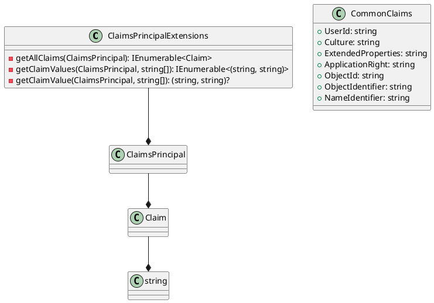

**Claims Library Documentation**
=============================

**Overview**
---------

The Claims Library is a set of classes and constants used to manage claims on a `ClaimsPrincipal` object.

### ClaimsPrincipalExtensions

#### Description

`ClaimsPrincipalExtensions` is a static class that provides extension methods for managing claims on a `ClaimsPrincipal` object.

#### Methods

* `GetAllClaims(this ClaimsPrincipal principal)`: Returns an enumerable collection of all claims for the provided `ClaimsPrincipal`.
* `GetClaimValues(this ClaimsPrincipal principal, params string[] claims)`: Returns an enumerable collection of claims that match the provided claim types, with their corresponding values.
* `GetClaimValue(this ClaimsPrincipal principal, params string[] claims)`: Returns the first claim that matches the provided claim types, with its corresponding value.

### CommonClaims

#### Description

`CommonClaims` is a static class that contains constants for common claims used in authentication.

#### Constants

* `UserId`: Represents the claim for user ID.
* `Culture`: Represents the claim for user culture.
* `ExtendedProperties`: Represents the claim for extended properties.
* `ApplicationRight`: Represents the claim for application rights.
* `ObjectId`: Represents the claim for object ID.
* `ObjectIdentifier`: Represents the claim for object identifier.
* `NameIdentifier`: Represents the claim for name identifier.

**Class Diagram**
~~~~~~~~~~~~~~~
