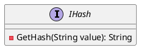
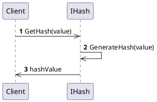

# Documentation for IHash Interface

## Introduction

The `IHash` interface is a simplified hash generator that provides a method to generate a cryptographic hash for a given input value.

## Interface Definition

### `IHash` Interface

```IHash.cs
namespace Eliassen.System.Security.Cryptography;

/// <summary>
/// Simplified hash generator
/// </summary>
public interface IHash
{
    /// <summary>
    /// Cryptographic hash for input value
    /// </summary>
    /// <param name="value">value to hash</param>
    /// <returns>hash input</returns>
    string GetHash(string value);
}
```

### Class Diagram



### Component Model

The `IHash` interface is a standalone component that provides a single method for generating a cryptographic hash.

### Sequence Diagram



## Usage

To use the `IHash` interface, simply create an implementation of the interface and call the `GetHash` method, passing in the input value to be hashed.

Example:
```csharp
public class SHA256Hash : IHash
{
    public string GetHash(string value)
    {
        // implementation of SHA256 hash generation
        return value.GetHashCode().ToString();
    }
}
```

## Benefits

The `IHash` interface provides a simplified way to generate a cryptographic hash for a given input value, making it easier to integrate with other systems and algorithms.

## Limitations

The `IHash` interface only provides a single method for generating a hash and does not provide any additional functionality.