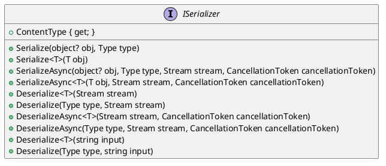

# Eliassen.System.Text Documentation

## ISerializer Interface

The `ISerializer` interface defines a set of methods for serializing and deserializing objects. It provides a way to convert objects into a string representation and vice versa.

### Methods

#### Serialize

The `Serialize` method converts an object into a string representation.

* `Serialize(object? obj, Type type)`: Converts the object `obj` of type `type` into a string.
* `Serialize<T>(T obj)`: Converts the object `obj` of type `T` into a string.
* `SerializeAsync(object? obj, Type type, Stream stream, CancellationToken cancellationToken = default)`: Asynchronously converts the object `obj` of type `type` into a stream.
* `SerializeAsync<T>(T obj, Stream stream, CancellationToken cancellationToken = default)`: Asynchronously converts the object `obj` of type `T` into a stream.

#### Deserialize

The `Deserialize` method converts a string or stream into an object.

* `Deserialize<T>(Stream stream)`: Converts the stream into an object of type `T`.
* `Deserialize(Type type, Stream stream)`: Converts the stream into an object of type `type`.
* `DeserializeAsync<T>(Stream stream, CancellationToken cancellationToken = default)`: Asynchronously converts the stream into an object of type `T`.
* `DeserializeAsync(Type type, Stream stream, CancellationToken cancellationToken = default)`: Asynchronously converts the stream into an object of type `type`.

#### Deserialize with input

The `Deserialize` method converts a string into an object.

* `Deserialize<T>(string input)`: Converts the string into an object of type `T`.
* `Deserialize(Type type, string input)`: Converts the string into an object of type `type`.

### Properties

* `ContentType { get; }`: Returns the content type supported by this serializer.

### Class Diagram



### Component Model

```plantuml
@startuml
component ISerializer {
  interface Serialize
  interface Deserialize
  property Content-Type
}

@enduml
```

### Sequence Diagram

```plantuml
@startuml
sequenceDiagram
participant ISerializer as serializer
participant Object as object
participant String as string
participant Stream as stream
participant CancellationToken as cancellationToken

note "Serialize Object to String" as serialize
serializer->>object: Serialize(object, string)
object->>serializer: object
serializer->>string: string

note "Serialize Object to Stream" as serialize
serializer->>object: SerializeAsync(object, stream)
object->>serializer: object
serializer->>stream: stream
note "Serialize Object to Stream with CancellationToken" as serialize
serializer->>object: SerializeAsync(object, stream, cancellationToken)
object->>serializer: object
serializer->>stream: stream
cancellationToken->>serializer: cancellationToken

note "Deserialize String to Object" as deserialize
serializer->>string: Deserialize(string, object)
string->>serializer: string
serializer->>object: object

note "Deserialize Stream to Object" as deserialize
serializer->>stream: Deserialize(stream, object)
stream->>serializer: stream
serializer->>object: object
note "Deserialize Stream to Object with CancellationToken" as deserialize
serializer->>stream: DeserializeAsync(stream, object, cancellationToken)
stream->>serializer: stream
serializer->>object: object
cancellationToken->>serializer: cancellationToken
@enduml
```