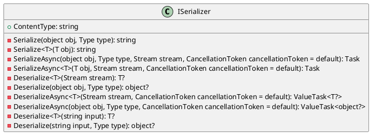

**Documentation for ISerializer.cs**

**Class Diagram (PlantUML)**

**Interface Documentation**

The `ISerializer` interface defines a set of methods for serializing and deserializing objects to and from various data formats. The interface provides a way to serialize and deserialize objects of various types, including primitives, custom objects, and collections.

**Methods**

1. `Serialize(object obj, Type type)`: Serializes the specified object to a string based on the specified type.
2. `Serialize<T>(T obj)`: Serializes the specified object of type `T` to a string.
3. `SerializeAsync(object obj, Type type, Stream stream, CancellationToken cancellationToken = default)`: Asynchronously serializes the specified object to a stream based on the specified type.
4. `SerializeAsync<T>(T obj, Stream stream, CancellationToken cancellationToken = default)`: Asynchronously serializes the specified object of type `T` to a stream.
5. `Deserialize<T>(Stream stream)`: Deserializes a stream into an object of type `T`.
6. `Deserialize(object obj, Type type)`: Deserializes a stream into an object of type `T` based on the specified type.
7. `DeserializeAsync<T>(Stream stream, CancellationToken cancellationToken = default)`: Asynchronously deserializes a stream into an object of type `T`.
8. `DeserializeAsync(object obj, Type type, CancellationToken cancellationToken = default)`: Asynchronously deserializes a stream into an object of type `T` based on the specified type.
9. `Deserialize<T>(string input)`: Deserializes a string into an object of type `T`.
10. `Deserialize(string input, Type type)`: Deserializes a string into an object of type `T` based on the specified type.

**Properties**

1. `ContentType`: Returns the content type supported by this serializer.

**Notes**

* The `ISerializer` interface provides a way to serialize and deserialize objects of various types, including primitives, custom objects, and collections.
* The `Serialize` and `Deserialize` methods can be used to serialize and deserialize objects in a synchronous manner, while the `SerializeAsync` and `DeserializeAsync` methods can be used to serialize and deserialize objects asynchronously.
* The `ContentType` property returns the content type supported by this serializer.

**License**

This documentation is licensed under the MIT License.