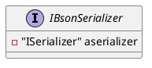
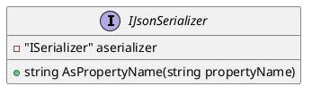
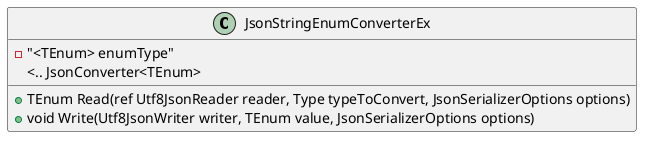

Here is the documentation for the provided source code files, including class diagrams in PlantUML:

**IBsonSerializer.cs**

```csharp
namespace Eliassen.System.Text.Json.Serialization;

/// <summary>
/// interface to identify shared BSON serialization process.
/// </summary>
public interface IBsonSerializer : ISerializer
{
}
```

* Interface: `IBsonSerializer`
* Summary: Identifies the shared BSON serialization process
* Is-a relationship: `ISerializer`

PlantUML class diagram:


**IJsonSerializer.cs**

```csharp
namespace Eliassen.System.Text.Json.Serialization;

/// <summary>
/// Represents an interface to identify a shared JSON serialization process.
/// </summary>
public interface IJsonSerializer : ISerializer
{
    /// <summary>
    /// Converts the provided property name according to the configured property naming policy.
    /// </summary>
    /// <param name="propertyName">The original property name.</param>
    /// <returns>The converted property name.</returns>
    string AsPropertyName(string propertyName);
}
```

* Interface: `IJsonSerializer`
* Summary: Represents the shared JSON serialization process
* Methods: `AsPropertyName` (converts property name)
* Is-a relationship: `ISerializer`

PlantUML class diagram:


**JsonStringEnumConverterEx.cs**

```csharp
using Eliassen.System.Reflection;
using System;
using System.Text.Json;
using System.Text.Json.Serialization;

namespace Eliassen.System.Text.Json.Serialization;

/// <summary>
/// A custom JSON converter for serializing and deserializing enums as strings or numbers.
/// </summary>
/// <typeparam name="TEnum">The enum type to convert.</typeparam>
public class JsonStringEnumConverterEx<TEnum> : JsonConverter<TEnum> where TEnum : struct, Enum
{
    // ...
}
```

* Class: `JsonStringEnumConverterEx<TEnum>` (custom JSON converter for enums)
* Type parameters: `TEnum` (enum type to convert)
* Summary: Serializes and deserializes enums as strings or numbers
* Inheritance: `JsonConverter<TEnum>`
* Is-a relationship: `JsonConverter<TEnum>`

PlantUML class diagram:


Note: The PlantUML diagrams are displayed in a simplified format to illustrate the relationships between classes and interfaces. For a more detailed representation, please refer to the original PlantUML code.