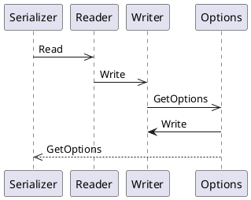

Here is the documentation for the source code in Markdown format:

# Eliassen.System.Text.Json.Serialization

### IBsonSerializer.cs

```csharp
namespace Eliassen.System.Text.Json.Serialization;

/// <summary>
/// interface to identify shared BSON serialization process.
/// </summary>
public interface IBsonSerializer : ISerializer
{
}
```

### IJsonSerializer.cs

```csharp
namespace Eliassen.System.Text.Json.Serialization;

/// <summary>
/// Represents an interface to identify a shared JSON serialization process.
/// </summary>
public interface IJsonSerializer : ISerializer
{
    /// <summary>
    /// Converts the provided property name according to the configured property naming policy.
    /// </summary>
    /// <param name="propertyName">The original property name.</param>
    /// <returns>The converted property name.</returns>
    string AsPropertyName(string propertyName);
}
```

### JsonStringEnumConverterEx.cs

```csharp
using Eliassen.System.Reflection;
using System;
using System.Text.Json;
using System.Text.Json.Serialization;

namespace Eliassen.System.Text.Json.Serialization;

/// <summary>
/// A custom JSON converter for serializing and deserializing enums as strings or numbers.
/// </summary>
/// <typeparam name="TEnum">The enum type to convert.</typeparam>
public class JsonStringEnumConverterEx<TEnum> : JsonConverter<TEnum> where TEnum : struct, Enum
{
    /// <summary>
    /// Reads the JSON representation of the enum value and converts it to the specified enum type.
    /// </summary>
    /// <param name="reader">The JSON reader.</param>
    /// <param name="typeToConvert">The type of the object to convert.</param>
    /// <param name="options">The serializer options.</param>
    /// <returns>The deserialized enum value.</returns>
    public override TEnum Read(ref Utf8JsonReader reader, Type typeToConvert, JsonSerializerOptions options)
    {
        var type = reader.TokenType;
        if (type == JsonTokenType.String)
        {
            var value = reader.GetString();
            var enumValue = value.ToEnum<TEnum>();
            return enumValue ?? default;
        }
        else if (type == JsonTokenType.Number)
        {
            var value = reader.GetInt32();
            var enumValue = value.ToEnum<TEnum>();
            return enumValue;
        }

        return default;
    }

    /// <summary>
    /// Writes the JSON representation of the enum value.
    /// </summary>
    /// <param name="writer">The JSON writer.</param>
    /// <param name="value">The enum value to serialize.</param>
    /// <param name="options">The serializer options.</param>
    public override void Write(Utf8JsonWriter writer, TEnum value, JsonSerializerOptions options) => writer.WriteStringValue(EnumExtensions.AsString<TEnum>(value));
}
```

### UML Diagrams

```plantuml
@startuml
interface ISerializer {
  - serialize(object value)
  - deserialize(string json, Type type)
}

interface IBsonSerializer extends ISerializer {
}

interface IJsonSerializer extends ISerializer {
  + AsPropertyName(string propertyName)
}

class JsonStringEnumConverterEx<TEnum> {
  + Read(Utf8JsonReader reader, Type type, JsonSerializerOptions options) returns TEnum
  + Write(Utf8JsonWriter writer, TEnum value, JsonSerializerOptions options)
}

TEnum ->+ JsonStringEnumConverterEx<TEnum>
IBsonSerializer --extends-- ISerializer
IJsonSerializer --extends-- ISerializer
@JsonStringEnumConverterEx<TEnum> --implements-- JsonConverter<TEnum>
@enduml
```

This class diagram shows the relationships between the interfaces and classes in the Eliassen.System.Text.Json.Serialization namespace.

```plantuml
@startuml
component "Eliassen.System.Text.Json.Serialization" as serializer {
  interface ISerializer
  interface IBsonSerializer
  interface IJsonSerializer
  class JsonStringEnumConverterEx<TEnum>
}

component "User Code" as user {
  .. ISerializer
  .. IBsonSerializer
  .. IJsonSerializer
}

serializer ->> user: uses
@enduml
```

This component diagram shows the components and their relationships. The "Eliassen.System.Text.Json.Serialization" component is the layer of code that provides the serialization and deserialization functionality, while the "User Code" component is the user's code that uses this functionality.



This sequence diagram shows the interactions between the serializer, reader, writer, and options in the Eliassen.System.Text.Json.Serialization namespace. The serializer uses the reader to read the JSON data, and then