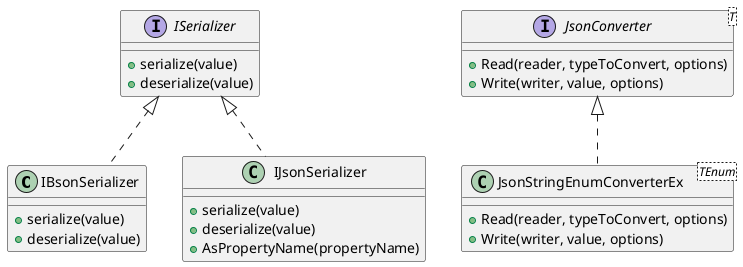

# Eliassen.System.Text.Json.Serialization

This repository provides a set of classes and interfaces for custom JSON and BSON serialization and deserialization. The main components are:

## Interfaces

* `IBsonSerializer`: an interface that defines the shared BSON serialization process.
* `IJsonSerializer`: an interface that defines the shared JSON serialization process and provides a method to convert property names according to a configured property naming policy.

## Classes

* `JsonStringEnumConverterEx<TEnum>`: a custom JSON converter for serializing and deserializing enums as strings or numbers.

## Technical Summary

The `IJsonSerializer` interface is implemented using the Factory method design pattern to enable the creation of JSON serialization instances. The `JsonStringEnumConverterEx<TEnum>` class uses the Adapter pattern to convert JSON enumeration values to and from the underlying enum type.



**Component Diagram**

```plantuml
@startuml
!include https://raw.githubusercontent.com/plantuml-stdlib/C4-PlantUML/v1.0.0/C4_Context.puml

System_Boundary(boundary, "Eliassen.System.Text.Json.Serialization") {

    Actor(client)
    System_eliasen_serializer(boundary) {
        Component(json_serializer, "JsonSerializer", 
            <<Type>> "Implementation of IJsonSerializer" >>,
            <<Description>> "JSON serialization implementation" >>)
        Component(bson_serializer, "BSONSerializer", 
            <<Type>> "Implementation of IBsonSerializer" >>,
            <<Description>> "BSON serialization implementation" >>)
        Component(json_string_enum_converter, "JsonStringEnumConverterEx", 
            <<Type>> "Custom JSON converter for enum serialization" >>,
            <<Description>> "Converts JSON enum values to and from the underlying enum type" >>)
    } 

    Rel(client, json_serializer, "Uses")
    Rel(json_string_enum_converter, json_serializer, "Extends")
    Rel(bson_serializer, client, "Provides")
    Rel(json_serializer, client, "Provides")
}