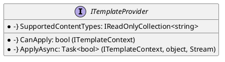
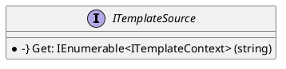
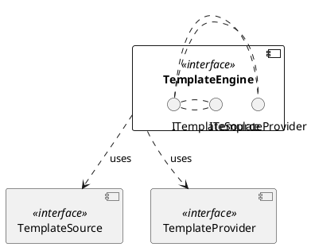
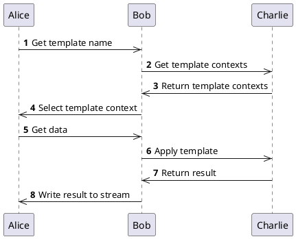

# Eliassen.System.Text.Templating Documentation

## Overview

The Eliassen.System.Text.Templating namespace provides a template engine that allows for the application of templates based on a specified context. The engine consists of two main components:

* `ITemplateProvider`: An interface that defines the contract for a template provider, which can apply templates based on a specified context.
* `ITemplateSource`: An interface that defines the contract for a template source, which provides a source of templates to be used by the template engine.

### ITemplateProvider

The `ITemplateProvider` interface defines the contract for a template provider. It has the following methods:

#### ITemplateProvider.SupportedContentTypes

Gets the collection of supported content types by the template provider.

#### ITemplateProvider.CanApply

Determines whether the template provider can apply a template based on the provided context.

#### ITemplateProvider.ApplyAsync

Applies the template associated with the specified context, using the provided data, and writes the result to the target stream asynchronously.

### ITemplateSource

The `ITemplateSource` interface defines the contract for a template source. It has the following method:

#### ITemplateSource.Get

Gets the template contexts associated with the specified template name.

### Component Model

The following component model illustrates the relationship between the `ITemplateProvider` and `ITemplateSource` interfaces:

### Sequence Diagram

The following sequence diagram illustrates the flow of a template application using the `ITemplateProvider` and `ITemplateSource` interfaces:

## Implementation

The implementation of the `ITemplateProvider` and `ITemplateSource` interfaces is the responsibility of the template engine developers. The engine should implement these interfaces to provide a functional template application mechanism.