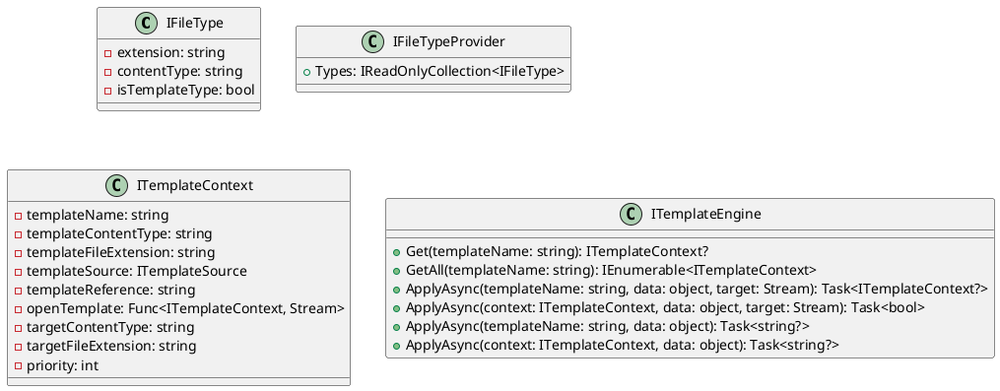
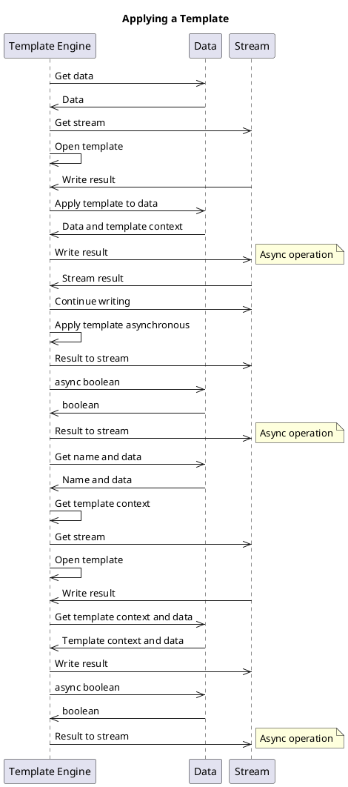

**Introduction**
===============

This documentation describes the source code of the Eliassen System Text Templating library, which provides a template engine for generating content based on templates. The library defines several interfaces, classes, and methods for managing file types, template contexts, and template engines.

**Overview of Interfaces**
-------------------------

### IFileType

The `IFileType` interface defines a set of properties that describe a file type, including its extension, content type, and whether it is a template type.

### IFileTypeProvider

The `IFileTypeProvider` interface provides a collection of `IFileType` objects.

### ITemplateContext

The `ITemplateContext` interface represents the context for a template, including information about the template and target content types, source, and priority.

### ITemplateEngine

The `ITemplateEngine` interface defines methods for managing templates, including getting and applying templates, and writing results to a stream or returning as a string.

**Class Diagram**
----------------

**Sequence Diagram - Applying a Template**
----------------------------------------

**Component Model**
-----------------

The Eliassen System Text Templating library consists of the following components:

* `IFileType`: represents a file type
* `IFileTypeProvider`: provides a collection of `IFileType` objects
* `ITemplateContext`: represents a template context
* `ITemplateEngine`: manages templates

These components interact with each other through interfaces and methods to provide a template engine for generating content based on templates.