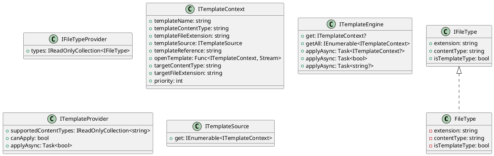

Here is the documentation for the provided source code files:

**FileType.cs**
```csharp
namespace Eliassen.System.Text.Templating;

public record FileType : IFileType
{
    public required string Extension { get; set; }
    public required string ContentType { get; set; }
    public bool IsTemplateType { get; set; }
}
```
**IFileType.cs**
```csharp
namespace Eliassen.System.Text.Templating;

public interface IFileType
{
    string Extension { get; }
    string ContentType { get; }
    bool IsTemplateType { get; }
}
```
**IFileTypeProvider.cs**
```csharp
namespace Eliassen.System.Text.Templating;

public interface IFileTypeProvider
{
    IReadOnlyCollection<IFileType> Types { get; }
}
```
**ITemplateContext.cs**
```csharp
namespace Eliassen.System.Text.Templating;

public interface ITemplateContext
{
    string TemplateName { get; }
    string TemplateContentType { get; }
    string TemplateFileExtension { get; }
    ITemplateSource TemplateSource { get; }
    string TemplateReference { get; }
    Func<ITemplateContext, Stream> OpenTemplate { get; }
    string TargetContentType { get; }
    string TargetFileExtension { get; }
    int Priority { get; }
}
```
**ITemplateEngine.cs**
```csharp
namespace Eliassen.System.Text.Templating;

public interface ITemplateEngine
{
    ITemplateContext? Get(string templateName);
    IEnumerable<ITemplateContext> GetAll(string templateName);
    Task<ITemplateContext?> ApplyAsync(string templateName, object data, Stream target);
    Task<bool> ApplyAsync(ITemplateContext context, object data, Stream target);
    Task<string?> ApplyAsync(string templateName, object data);
    Task<string?> ApplyAsync(ITemplateContext context, object data);
}
```
**ITemplateProvider.cs**
```csharp
namespace Eliassen.System.Text.Templating;

public interface ITemplateProvider
{
    IReadOnlyCollection<string> SupportedContentTypes { get; }
    bool CanApply(ITemplateContext context);
    Task<bool> ApplyAsync(ITemplateContext context, object data, Stream target);
}
```
**ITemplateSource.cs**
```csharp
namespace Eliassen.System.Text.Templating;

public interface ITemplateSource
{
    IEnumerable<ITemplateContext> Get(string templateName);
}
```
**Class Diagrams in Plant UML**

Here is the class diagram for the provided source code files:

The class diagram shows the relationships between the classes `FileType`, `IFileType`, `IFileTypeProvider`, `ITemplateContext`, `ITemplateEngine`, `ITemplateProvider`, and `ITemplateSource`.