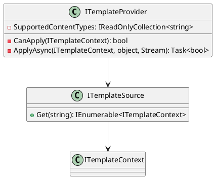

**README.md**

**Summary:**

This repository contains two interfaces, `ITemplateProvider` and `ITemplateSource`, that form the foundation of a template engine. `ITemplateProvider` represents a template provider that can apply templates based on a specified context, while `ITemplateSource` represents a source of templates. Together, these interfaces enable the creation of a robust template engine that can render templates asynchronously.

**Technical Summary:**

The `ITemplateProvider` interface follows theollywood pattern, which is a type of decorator pattern. This pattern allows multiple template providers to be chained together, enabling the engine to apply templates in a hierarchical manner. The `ITemplateSource` interface uses the repository pattern, which is a type of creational pattern. This pattern allows multiple template sources to be managed and retrieved by the engine.

**Component Diagram:**

```
