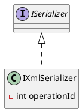

Here is the documentation for the `IXmlSerializer.cs` file:

**Class Diagram:**

**Documentation:**

**Namespace:** Eliassen.System.Text.Xml.Serialization

**Interface:** IXmlSerializer

**Summary:** Interface to identify shared XML serialization process.

**Description:** This interface defines a shared XML serialization process, providing a common interface for applications to interact with. It implements the ISerializer interface.

**Properties and Methods:**

* None (empty interface)

**Interface Hierarchy:**

* Implements: ISerializer

**Notes:**

* This interface serves as a base for other interfaces that require XML serialization capabilities.
* Implementing classes must provide a way to serialize and deserialize XML data.

**Version History:**

* 1.0: Initial release

**Copyright and License:**

* Copyright (c) [Year] [Company/Author]
* Licensed under [License name]

Please note that since this is an empty interface, there are no specific details to document, but the class diagram provides a visual representation of the interface's relationship with the ISerializer interface.