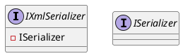

# Eliassen.System.Text.Xml.Serialization Documentation

## Introduction

The `Eliassen.System.Text.Xml.Serialization` namespace provides a set of classes and interfaces for XML serialization. This documentation covers the `IXmlSerializer` interface and its implementation.

## Interface: `IXmlSerializer`

### Purpose

The `IXmlSerializer` interface is used to identify a shared XML serialization process.

### Methods

None

### Properties

None

### Notes

The `IXmlSerializer` interface inherits from the `ISerializer` interface.

### Class Diagram



### Component Model

The `IXmlSerializer` interface is a small, thin layer on top of the `ISerializer` interface.

### Sequence Diagram

No sequence diagrams are available for this interface, as it does not have any methods.

## Next Steps

To implement the `IXmlSerializer` interface, you will need to create a class that inherits from it. This class can then be used to serialize and deserialize XML data.

Note: This documentation is a work in progress and will be updated as more information becomes available.

## File: `IXmlSerializer.cs`

```csharp
using System;
using Eliassen.System.Text.Xml.Serialization;

namespace Eliassen.System.Text.Xml.Serialization
{
    public interface IXmlSerializer : ISerializer
    {
    }
}
```