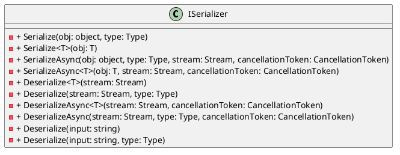

Here is a summary of the functionality and architecture of the provided source files:

**Summary**

The provided source files define an interface `ISerializer` that provides serialization and deserialization functionality for .NET objects. The interface supports serializing and deserializing objects to and from various formats, including strings and streams. The serializer also provides asynchronous versions of the serialization and deserialization methods.

**Technical Summary**

The `ISerializer` interface implements the following design patterns:

* **Single responsibility principle**: Each method in the interface has a single responsibility, either serializing or deserializing an object, and is designed to perform a specific task.
* **Polymorphism**: The interface provides multiple overloads for serialization and deserialization methods, allowing clients to use the serializer with different types of objects.
* **Async programming**: The interface provides asynchronous versions of the serialization and deserialization methods, allowing clients to use the serializer with asynchronous programming models.

The `ISerializer` interface also implements the following architectural pattern:

* **Factory method pattern**: The interface provides a set of methods for creating serialized and deserialized objects, allowing clients to use the serializer without knowing the internal implementation details.

**Component Diagram**

Here is a component diagram of the `ISerializer` interface using PlantUML:
```
