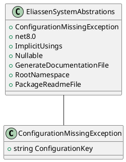

Here is a possible README file for the provided source files:

**Eliassen System Abstractions README**

**Overview**
-----------

The Eliassen System Abstractions library is a core component of the Eliassen Common Framework, providing a set of interface contracts and models for building and configuring Eliassen-based systems. This library facilitates the integration of various Eliassen components, enabling developers to create robust and scalable systems.

**Functionality**
---------------

The library consists of a single exception type, `ConfigurationMissingException`, which is thrown when a required configuration is missing. Additionally, the library provides an abstractions project file (`Eliassen.System.Abstrations.csproj`) that defines the dependencies and compilation settings for the library.

**Design and Architecture**
-------------------------

The Eliassen System Abstractions library follows a straightforward, modular design, with each component serving a specific purpose:

* `ConfigurationMissingException` is a simple exception class that represents a missing configuration value.
* The `Eliassen.System.Abstrations.csproj` file defines the project settings and dependencies for the library.

**Technical Summary**
------------------

* The library uses a simple, object-oriented design, with each component implemented as a separate class.
* The `ConfigurationMissingException` class follows standard .NET exception syntax and is thrown when a required configuration value is missing.
* The `Eliassen.System.Abstrations.csproj` file employs standard .NET project syntax and defines the library's dependencies and compilation settings.

**Component Diagram**
---------------------

Here is a component diagram for the Eliassen System Abstractions library using PlantUML:
