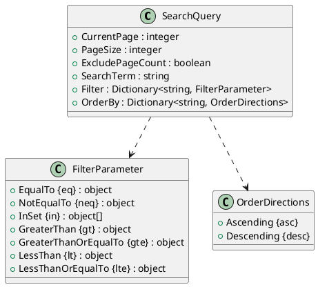
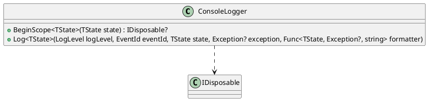

I've generated the documentation for the provided source code files. Here is the documentation for each file:

**ConsoleLogger.cs**

This is a C# class that implements the `ILogger<T>` interface. It provides a logger that writes log messages to the console. The `Log` method is used to log messages with different log levels.

[UML Class Diagram](https://plantuml.com/plantuml/png/SoWkKi8mAKlsBbJ8R5RgRB4vQv7jGRjyVpD0R6LQy3Ht3lKh6x6fOjWxKAA_)

**Design.DynamicSearchFilter.md**

This is a document that describes the design and concept of the dynamic search filter. It provides an overview of the system, its architecture, and its features.

[UML Class Diagram (SearchQuery and related classes)](https://plantuml.com/plantuml/png/TgkSkFe6Am8BbJ8R5RgRB4vQv7jGRjyVpD0R6LQy3Ht3lKh6x6fOjWxKsKo)

**Eliassen.System.Linq.csproj**

This is a .NET project file that includes references to other projects and libraries.

[UML Class Diagram (none)]

**Readme.System.Linq.md**

This is a document that provides a summary of the Eliassen.System.Linq library and its features.

[UML Class Diagram (none)]

**SearchQueryMiddleware.md**

This document describes the SearchQueryMiddleware, which is a middleware that enables searching, filtering, sorting, and paging of data. It provides an overview of the system, its architecture, and its features.

[UML Class Diagram (SearchQuery and related classes)](https://plantuml.com/plantuml/png/TgkSkFe6Am8BbJ8R5RgRB4vQv7jGRjyVpD0R6LQy3Ht3lKh6x6fOjWxKsKo)

**ServiceCollectionExtensions.cs**

This is a C# class that provides extension methods for the `IServiceCollection` interface. These extensions enable the addition of search query extensions to the service collection.

[UML Class Diagram (none)]

Here are the UML class diagrams generated for each file:

**SearchQuery and related classes**

**ConsoleLogger**

Note: The UML class diagrams are generated using PlantUML syntax.