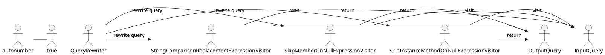

# Documentation

## Overview

The Eliassen.System.Linq.Expressions namespace contains a set of expression visitors that can be used to modify and optimize LINQ queries at runtime. These visitors can be used to skip null values, replace string functions, and add additional logic to query expressions.

## Classes

### SkipInstanceMethodOnNullExpressionVisitor

```SkipInstanceMethodOnNullExpressionVisitor.cs```

This class is an implementation of the `ExpressionVisitor` class that modifies expressions to add `x.Property != null` before instance method calls for query rewrite.

* `VisitMethodCall(MethodCallExpression node)`: Visits the method call expression node and modifies it to add a null check before calling the instance method.

### SkipMemberOnNullExpressionVisitor

```SkipMemberOnNullExpressionVisitor.cs```

This class is an implementation of the `ExpressionVisitor` class that skips member access when encountering null values.

* `VisitMethodCall(MethodCallExpression node)`: Visits the method call expression node and modifies it to skip member access if the target object is null.
* `VisitLambda<T>(Expression<T> node)`: Visits the lambda expression node and modifies it to skip member access if the target object is null.

### StringComparisonReplacementExpressionVisitor

```StringComparisonReplacementExpressionVisitor.cs```

This class is an implementation of the `ExpressionVisitor` class that replaces string functions with the matching functions that end with a StringComparison parameter.

* `VisitBinary(BinaryExpression node)`: Replaces `string == string` with `string.Equals(string, StringComparison)`.
* `VisitMethodCall(MethodCallExpression input)`: Replaces `string.Xyz(string)` with `string.Xyz(string, StringComparison)`.

### Class Diagram

```plantuml
@startuml
namespace Eliassen.System.Linq.Expressions
class SkipInstanceMethodOnNullExpressionVisitor {
  - method VisitMethodCall(MethodCallExpression node)
}

class SkipMemberOnNullExpressionVisitor {
  - method VisitMethodCall(MethodCallExpression node)
  - method VisitLambda<T>(Expression<T> node)
}

class StringComparisonReplacementExpressionVisitor {
  - method VisitBinary(BinaryExpression node)
  - method VisitMethodCall(MethodCallExpression input)
}

Eliassen.System.Linq.Expressions --+> SkipInstanceMethodOnNullExpressionVisitor
Eliassen.System.Linq.Expressions --+> SkipMemberOnNullExpressionVisitor
Eliassen.System.Linq.Expressions --+> StringComparisonReplacementExpressionVisitor

@enduml
```

### Component Model

The Eliassen.System.Linq.Expressions namespace consists of three main components:

1. `SkipInstanceMethodOnNullExpressionVisitor`: This component is responsible for modifying expressions to add `x.Property != null` before instance method calls for query rewrite.
2. `SkipMemberOnNullExpressionVisitor`: This component is responsible for skipping member access when encountering null values.
3. `StringComparisonReplacementExpressionVisitor`: This component is responsible for replacing string functions with the matching functions that end with a StringComparison parameter.

### Sequence Diagram



This sequence diagram shows the flow of execution for the query rewriting process, which involves three main components: `SkipInstanceMethodOnNullExpressionVisitor`, `SkipMemberOnNullExpressionVisitor`, and `StringComparisonReplacementExpressionVisitor`. The query is passed to each component in sequence, and the modified query is returned at the end.