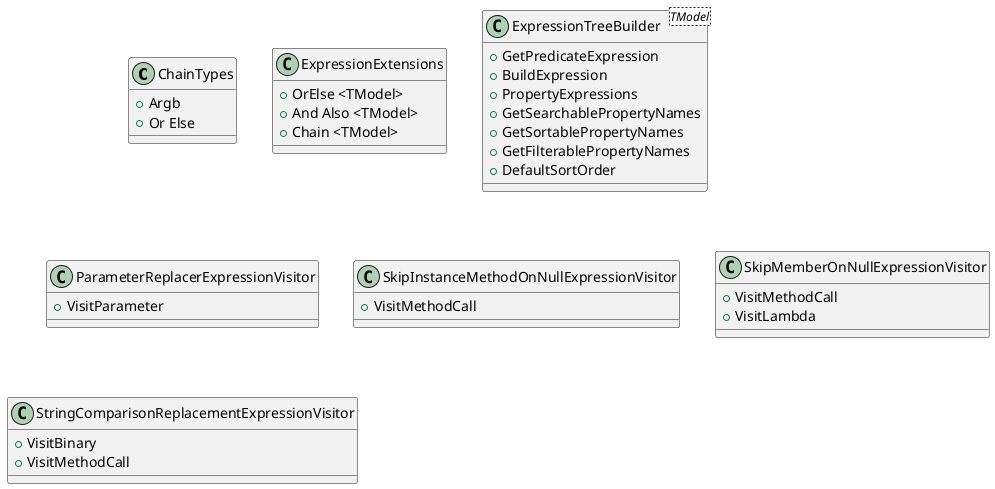

**Class Diagrams**

Here are the class diagrams for the source code files using PlantUML:

**Documentation**

**ChainTypes**

The `ChainTypes` enum defines the possible types of chaining operators in the filtering expressions. These can be either logical `And` or `Or`.

**ExpressionExtensions**

The `ExpressionExtensions` class provides static methods for building and chaining expressions. These methods allow for constructing and combining predicate expressions based on the filtering criteria.

**ExpressionTreeBuilder<TModel>**

The `ExpressionTreeBuilder<TModel>` class is responsible for creating and managing expression trees for filtering and sorting data. It provides methods for building expressions, getting searchable property names, and retrieving default sort orders.

**ParameterReplacerExpressionVisitor**

The `ParameterReplacerExpressionVisitor` class is an expression visitor that replaces parameters with a specific parameter expression.

**SkipInstanceMethodOnNullExpressionVisitor**

The `SkipInstanceMethodOnNullExpressionVisitor` class is an expression visitor that skips instance method calls if the object is null.

**SkipMemberOnNullExpressionVisitor**

The `SkipMemberOnNullExpressionVisitor` class is an expression visitor that skips member access if the target object is null.

**StringComparisonReplacementExpressionVisitor**

The `StringComparisonReplacementExpressionVisitor` class is an expression visitor that replaces string functions with their equivalent methods that take a `StringComparison` parameter. This allows for more flexible filtering and sorting of data.

Please note that these diagrams and documentation are based on the provided source code and may not cover all possible scenarios or edge cases.