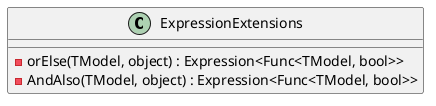
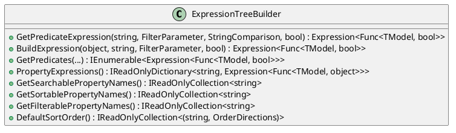
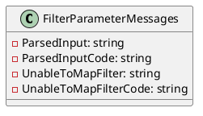
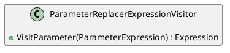

Here is the documentation for the source code:

**ChainTypes.cs**

This file defines an internal enum called `ChainTypes` with two values: `AndAlso` and `OrElse`. These values are used to specify the logical operator for building expression chains.

**ExpressionExtensions.cs**

This file extends the `Expression` class with two static methods: `OrElse` and `AndAlso`. These methods are used to build expression chains.

**ExpressionTreeBuilder.cs**

This class is responsible for building and managing expression trees dynamically in the context of filtering data. It takes two optional parameters: `logger` and `capture`, used for logging and capturing result messages.

**FilterParameterMessages.cs**

This file defines static strings for error messages related to filter parameter parsing.

**ParameterReplacerExpressionVisitor.cs**

This class is a visitor that replaces a parameter expression with a new parameter expression. It takes a `ParameterExpression` in its constructor and overrides the `VisitParameter` method.

Note: The PlantUML diagrams are used to illustrate the relationships between classes and methods.