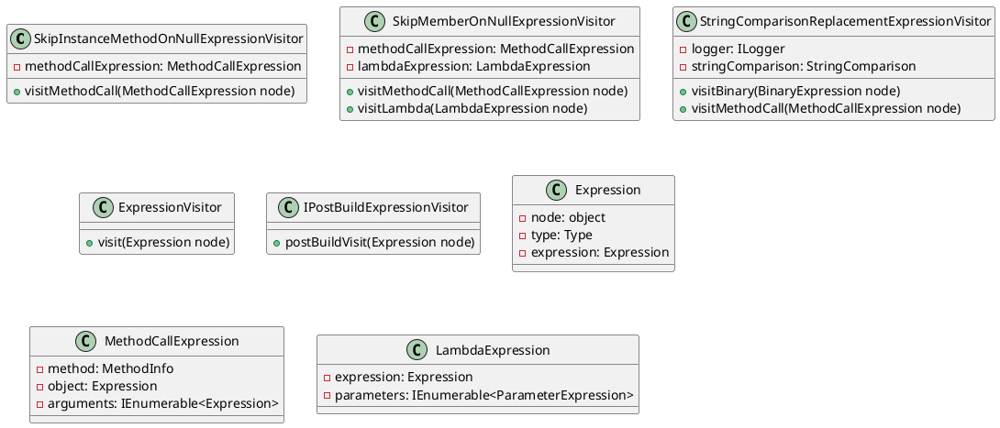

**README**

This repository contains a set of C# classes that implement expression visitors for LINQ expressions. These visitors modify the expressions to add null checks before instance method calls and to skip member access when encountering null values. Additionally, one of the visitors replaces string comparison functions with their corresponding versions that take a StringComparison parameter.

**Summary of Functionality**

The `SkipInstanceMethodOnNullExpressionVisitor` modifies expressions to add null checks before instance method calls. This ensures that a method is only called if the instance object is not null.

The `SkipMemberOnNullExpressionVisitor` skips member access when encountering null values. This visitor is more specific than the previous one, as it only modifies method calls and lambdas when the method returns a boolean value.

The `StringComparisonReplacementExpressionVisitor` replaces string comparison functions with their corresponding versions that take a StringComparison parameter. This visitor is useful for replacing standard string comparison functions with their case-sensitive or culture-sensitive equivalents.

**Technical Summary**

The `StringComparisonReplacementExpressionVisitor` uses a combination of reflection and expression manipulation to replace method calls with their corresponding versions that take a StringComparison parameter. This is achieved by getting the declaring type of the method, checking if it's the `string` type, and then finding the corresponding method with the StringComparison parameter.

The `SkipInstanceMethodOnNullExpressionVisitor` and `SkipMemberOnNullExpressionVisitor` use a similar approach, but instead of replacing method calls, they modify the expressions to add null checks before instance method calls and to skip member access when encountering null values.

**Component Diagram**

